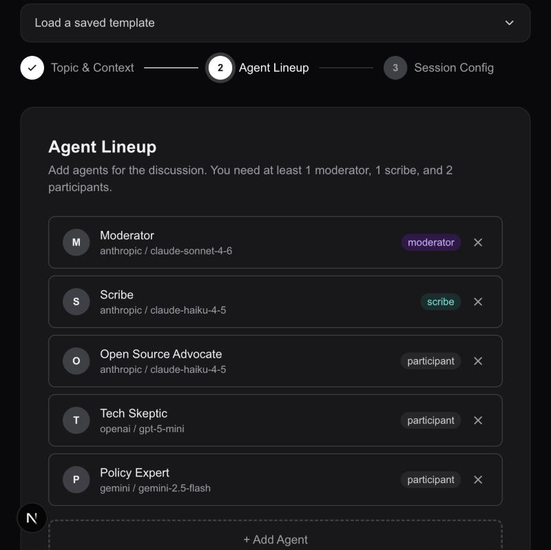
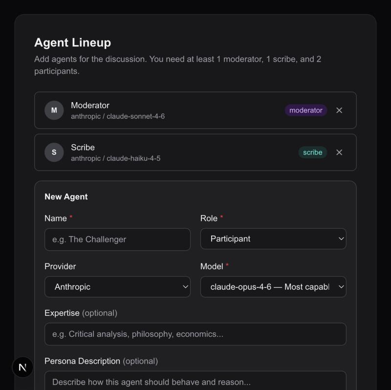
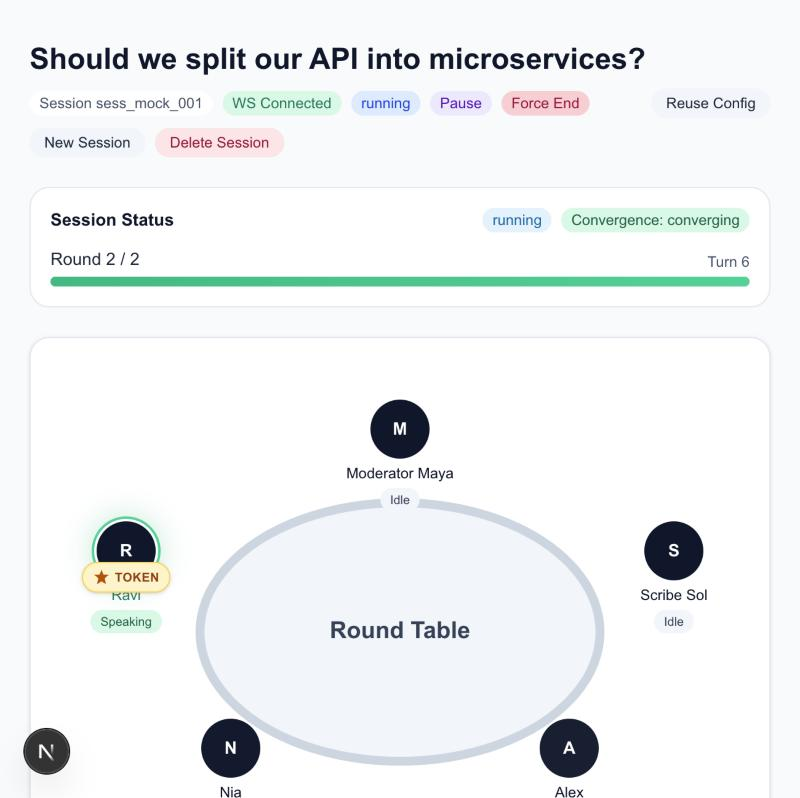
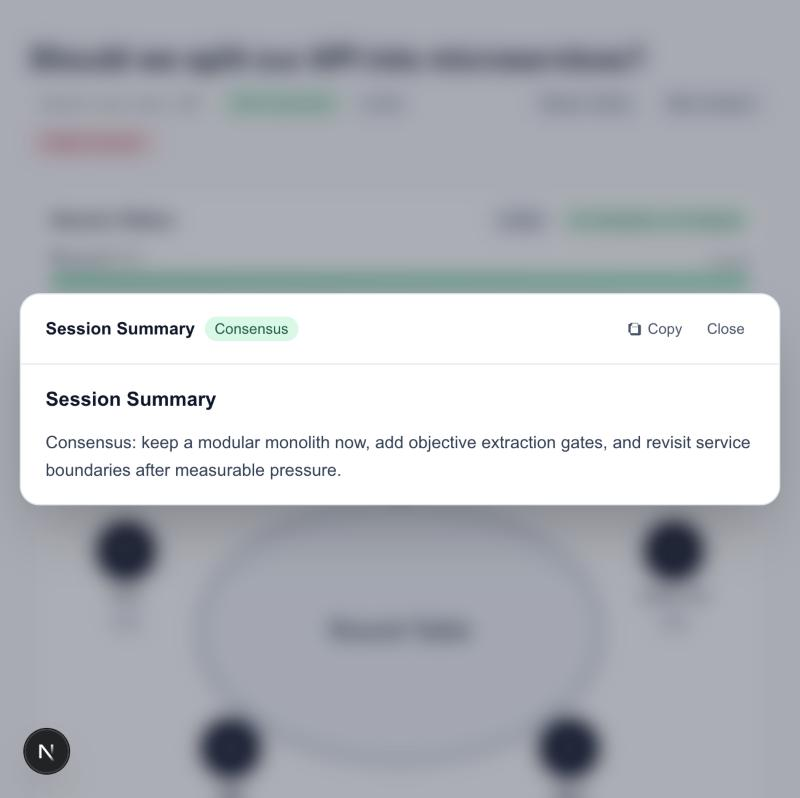

# AI Round Table

Set up a panel of AI agents with different personas, providers, and models, then watch them think, argue, and converge on a topic.


## Why I built this

I had a habit of asking the same question to multiple LLMs to get different perspectives. It worked pretty well. Different models would sometimes disagree, and both answers could be partially right. The conflict itself was useful.

At some point I thought: what if instead of me switching between tabs, the models could just talk to each other?

That's what this is. You pick a topic, set up a panel of agents (each with a different persona, model, and provider), and they debate it together until they reach a consensus. You get the diversity of perspectives you were looking for, but with the cross-examination built in.

## How it works

Each turn follows a **think, update, speak** cycle:

1. **Think** - every agent privately reasons about the topic and the arguments made so far, before saying anything publicly. This stops them from just anchoring to whoever spoke first.
2. **Update** - each agent revises its internal view based on new arguments.
3. **Speak** - the moderator picks the next agent based on priority scoring (how novel their argument is, their role, how recently they spoke), and they make their case.

A dedicated Moderator agent tracks whether positions are converging. When they are, it calls consensus and the Scribe produces a summary. You usually get a more nuanced answer than any single model would give on its own.

## Supported providers

Anthropic · OpenAI · Google Gemini · Ollama (local models)

## Setup

### Backend
1. `cd backend`
2. `python -m venv venv && source venv/bin/activate`
3. `pip install -r requirements.txt`
4. Create `.env` from `.env.example` and add your API keys
5. `uvicorn main:app --reload`

### Frontend
1. `npm install`
2. Create `frontend/.env.local` from `frontend/.env.example`
3. `cd frontend && npm run dev`

## Docker

Run both services with a single command:

```bash
export OPENAI_API_KEY=your-key
export ANTHROPIC_API_KEY=your-key

docker compose up --build
```

- **Backend:** http://localhost:8000
- **Frontend:** http://localhost:3000

## Screenshots

<table>
  <tr>
    <td></td>
    <td></td>
  </tr>
  <tr>
    <td align="center"><em>Multi-provider agent lineup</em></td>
    <td align="center"><em>Agent form with provider & model selection</em></td>
  </tr>
  <tr>
    <td></td>
    <td></td>
  </tr>
  <tr>
    <td align="center"><em>Live round table — agents debating in real time</em></td>
    <td align="center"><em>Session summary with consensus</em></td>
  </tr>
</table>
